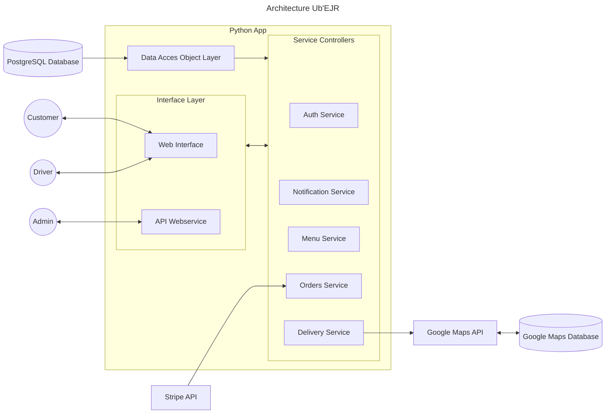

# Architecture 

```mermaid
---
title: Architecture Ub'EJR
config:
  layout: dagre
---
flowchart LR
 subgraph Services["Service Controllers"]
        AUTH["Auth Service"]
        NOTIF["Notification Service"]
        MENU["Menu Service"]
        ORDR["Orders Service"]
        DELIV["Delivery Service"]
  end
 subgraph Interfaces["Interface Layer"]
        WEB["Web Interface"]
        API["API Webservice"]
  end
 subgraph PythonApp["Python App"]
        DAO["Data Acces Object Layer"]
        Services
        Interfaces
  end
    STRIPE["Stripe API"] --> ORDR
    ADM(("Admin")) <--> API
    CUS(("Customer")) <--> WEB
    DEL(("Driver")) <--> WEB
    DAO --> Services
    DELIV --> GMAPI["Google Maps API"]
    GMAPI <--> GMDB[("Google Maps Database")]
    Interfaces <--> Services
    DB[("PostgreSQL Database")] --> DAO


```
