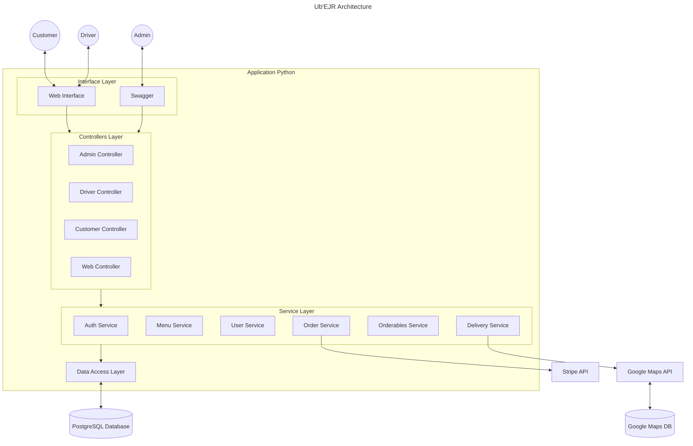

# Architecture 

```mermaid
---
config:
  layout: dagre
title: Ub'EJR Architecture
---
flowchart TB
 subgraph Interfaces["Interface Layer"]
        WEB["Web Interface"]
        API["Swagger"]
  end
 subgraph Controllers["Controllers Layer"]
        ADM_CTRL["Admin Controller"]
        MEL_CTRL["Driver Controller"]
        CUS_CTRL["Customer Controller"]
        WEB_CTRL["Web Controller"]
  end
 subgraph Services["Service Layer"]
        AUTH_SVC["Auth Service"]
        MENU_SVC["Menu Service"]
        USER_SVC["User Service"]
        ORDER_SVC["Order Service"]
        ORDERA_SVC["Orderables Service"]
        DELIV_SVC["Delivery Service"]
  end
 subgraph PythonApp["Application Python"]
        Interfaces
        Controllers
        Services
        DAO["Data Access Layer"]
  end
    CUS(("Customer")) <--> WEB
    DEL(("Driver")) <--> WEB
    ADM(("Admin")) <--> API
    WEB --> Controllers
    API --> Controllers
    Controllers --> Services
    Services --> DAO
    DAO <--> DB[("PostgreSQL Database")]
    ORDER_SVC --> STRIPE["Stripe API"]
    DELIV_SVC --> GMAPI["Google Maps API"] <--> GMDB[("Google Maps DB")]
```